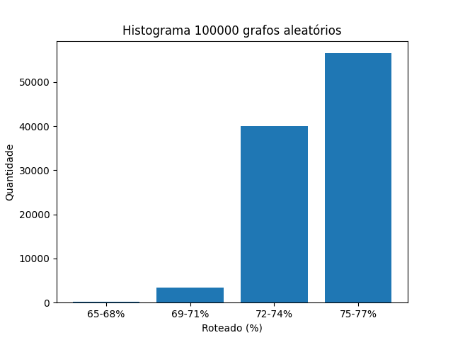
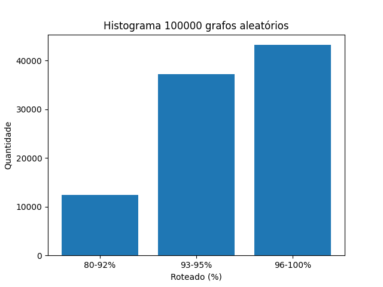
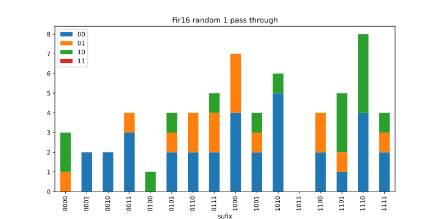

# Redes Multiestágio

## Como executar?

> ./route.sh <grafo\> <num_grafos_na_rede> <tipo_nomeamento> <num_iteracoes>\

> Para executar todos os grafos em misc\benchmark\dot:\
./route.sh all <num_grafos_na_rede> <tipo_nomeamento> <num_iteracoes>

## observação

> Todos experimentos não consideraram que quando um vértice possui 2 entradas 
são dois sinal diferentes.\
Como a lista de arestas foi gerada: profundidade, na direção da saida para entrada.

## Resultados parciais 1:

* Algumas informações:

    > Rede: 256x256, radix4 e 4 estágios + 1 extra (5 estágios)\
    > Grafo:              Fir16\
    > Vértices:           49\
    > Aréstas:            63\
    > Grau médio:         2.57\
    > Cabem 63*4=252 "Arestas" (4 grafos Fir16)

* Roteamento:

    > Roteou 65.0794% - 1 grafo(s) - sequencial - 1 estágios extras.\
    > Roteou 76.1905% - 1 grafo(s) - aleatório  - 1 estágios extras.\
    > Roteou 16.2698% - 4 grafo(s) - sequencial - 1 estágios extras.\
    > Roteou 59.127%  - 4 grafo(s) - aleatório  - 1 estágios extras.

## Resultados parciais 2:

* Validação do roteamento:
    - Teste 1: [Roteamento padrão i -> i](./misc/results/route_pattern_test1.txt)
    - Teste 2: [Roteamento padrão i -> i+n](./misc/results/route_pattern_test2.txt)

* Histograma roteando 100.000x aleatório 1 grafo (Fir16):

    

* Roteando após eliminar arestas do grafo para aliviar a rede (acrescentar conexão local vértice acima):

    > Roteou 93.3333% - 1 grafo(s) - sequencial - 1 estágios extras.\
    > Roteou 23.3333% - 4 grafo(s) - sequencial - 1 estágios extras.\
    > Roteou 100%     - 1 grafo(s) - aleatório  - 1 estágios extras.\
    > Roteou 91.6667% - 4 grafo(s) - aleatório  - 1 estágios extras.
   
# Considerando entradas diferentes:

## Resultados parciais 3:

### 1. Estatística da distribuição dos graus dos entrada

Grafo|grau 0|grau 1|grau 2|grau 3|Rótulos
---|---|---|---|---|---|
Fir16|1|33|15|0|63
**k4n4op**|4|35|15|1|68
fir2|16|9|15|0|39
interpolate_aux|48|16|44|0|104
horner_bezier_surf|4|10|3|0|16
h2v2_smooth|16|17|19|0|55
**jpeg_idct_ifast**|24|76|67|0|210
mults1|1|15|4|0|23
Cplx8|1|30|15|0|60
cosine2|31|9|41|0|91
ewf|2|17|15|0|47
simple|4|2|6|0|14
feedback_points|21|15|18|0|51
motion_vectors|14|7|11|0|29
arf|8|10|10|0|30
conv3|9|3|12|0|27
**jpeg_fdct_islow**|24|88|61|0|210
fir|22|1|21|0|43
mac|3|3|5|0|13
FilterRGB|2|40|15|0|70
fir1|22|1|21|0|43
cosine1|16|24|26|0|76

***
### 2. Propor uma distribuição T1 e T2 (ou T3)

> De fato, temos 1\*0 + 33\*1 + 15\*2 = 63 rótulos possíveis. Sequencialmente, poderíamos rotular de *0000 0000* até *0011 1111*. Assim, para os 33 rótulos podemos usar de índice os 2 últimos bits mais significativos sendo o 00. Já para os outros 30 rótulos podemos usar 01, 10 ou 11 como índices. Assim, usemos:

* Rótulos de vértices com grau 1:
    
    > *00xx xxxx*

* Rótulos de vértices com grau 2:

    > *01xx xxxx*\
        ou  
    *10xx xxxx*

* observação:

    > Nesse caso não da pra colocar mais de um grafo na rede, porque o primeiro grafo já ocupa 33 dos 63 rótulos de grau 1. Logo, o segundo teria apenas 30 rótulos, mas são necessários 33.
***
### 3. Fazer o sequencial e o aleatório

* Roteamento considerando entradas diferentes:

    > Roteou 96.8254% - 1 grafo(s) - T2 sequencial - 1 estágios extras.\
    > Roteou 100%     - 1 grafo(s) - T2 aleatório  - 1 estágios extras.

* Histograma roteando 100.000x aleatório 1 grafo (Fir16):

    

***
### 4. Testar para outros grafos 

* Roteamento: 

    Grafo|Roteado(%)|Grafos na Rede|Rotulamento|Estágio Extra
    ---|---|---|---|---|
    arf  |63.3333|1|sequencial|1
    arf  |66.6667|1|aleatório|1
    arf  |100|1|T2 sequencial|1
    arf  |100|1|T2 aleatório|1
    conv3  |55.5556|1|sequencial|1
    conv3  |55.5556|1|aleatório|1
    conv3  |92.5926|1|T2 sequencial|1
    conv3  |100|1|T2 aleatório|1
    cosine1  |57.8947|1|sequencial|1
    cosine1  |64.4737|1|aleatório|1
    cosine1  |97.3684|1|T2 sequencial|1
    cosine1  |98.6842|1|T2 aleatório|1
    cosine2  |52.7473|1|sequencial|1
    cosine2  |53.8462|1|aleatório|1
    cosine2  |87.9121|1|T2 sequencial|1
    cosine2  |87.9121|1|T2 aleatório|1
    Cplx8  |66.6667|1|sequencial|1
    Cplx8  |75|1|aleatório|1
    Cplx8  |96.6667|1|T2 sequencial|1
    Cplx8  |95|1|T2 aleatório|1
    ewf  |53.1915|1|sequencial|1
    ewf  |68.0851|1|aleatório|1
    ewf  |100|1|T2 sequencial|1
    ewf  |97.8723|1|T2 aleatório|1
    feedback_points  |62.7451|1|sequencial|1
    feedback_points  |64.7059|1|aleatório|1
    feedback_points  |100|1|T2 sequencial|1
    feedback_points  |96.0784|1|T2 aleatório|1
    FilterRGB  |61.4286|1|sequencial|1
    FilterRGB  |78.5714|1|aleatório|1
    FilterRGB  |95.7143|1|T2 sequencial|1
    FilterRGB  |94.2857|1|T2 aleatório|1
    Fir16  |65.0794|1|sequencial|1
    Fir16  |76.1905|1|aleatório|1
    Fir16  |96.8254|1|T2 sequencial|1
    Fir16  |96.8254|1|T2 aleatório|1
    fir1  |51.1628|1|sequencial|1
    fir1  |51.1628|1|aleatório|1
    fir1  |97.6744|1|T2 sequencial|1
    fir1  |100|1|T2 aleatório|1
    fir2  |58.9744|1|sequencial|1
    fir2  |61.5385|1|aleatório|1
    fir2  |100|1|T2 sequencial|1
    fir2  |100|1|T2 aleatório|1
    fir  |48.8372|1|sequencial|1
    fir  |51.1628|1|aleatório|1
    fir  |86.0465|1|T2 sequencial|1
    fir  |97.6744|1|T2 aleatório|1
    h2v2_smooth  |61.8182|1|sequencial|1
    h2v2_smooth  |65.4545|1|aleatório|1
    h2v2_smooth  |100|1|T2 sequencial|1
    h2v2_smooth  |100|1|T2 aleatório|1
    horner_bezier_surf  |81.25|1|sequencial|1
    horner_bezier_surf  |81.25|1|aleatório|1
    horner_bezier_surf  |100|1|T2 sequencial|1
    horner_bezier_surf  |100|1|T2 aleatório|1
    interpolate_aux  |56.7308|1|sequencial|1
    interpolate_aux  |57.6923|1|aleatório|1
    interpolate_aux  |85.5769|1|T2 sequencial|1
    interpolate_aux  |88.4615|1|T2 aleatório|1
    jpeg_fdct_islow  |-|1|sequencial|1
    jpeg_fdct_islow  |-|1|aleatório|1
    jpeg_fdct_islow  |-|1|T2 sequencial|1
    jpeg_fdct_islow  |-|1|T2 aleatório|1
    jpeg_idct_ifast  |-|1|sequencial|1
    jpeg_idct_ifast  |-|1|aleatório|1
    jpeg_idct_ifast  |-|1|T2 sequencial|1
    jpeg_idct_ifast  |-|1|T2 aleatório|1
    k4n4op  |-|1|sequencial|1
    k4n4op  |-|1|aleatório|1
    k4n4op  |-|1|T2 sequencial|1
    k4n4op  |-|1|T2 aleatório|1
    mac  |61.5385|1|sequencial|1
    mac  |61.5385|1|aleatório|1
    mac  |100|1|T2 sequencial|1
    mac  |100|1|T2 aleatório|1
    motion_vectors  |62.069|1|sequencial|1
    motion_vectors  |62.069|1|aleatório|1
    motion_vectors  |100|1|T2 sequencial|1
    motion_vectors  |100|1|T2 aleatório|1
    mults1  |73.913|1|sequencial|1
    mults1  |82.6087|1|aleatório|1
    mults1  |91.3043|1|T2 sequencial|1
    mults1  |100|1|T2 aleatório|1
    removed_Fir16  |96.6667|1|sequencial|1
    removed_Fir16  |100|1|aleatório|1
    removed_Fir16  |86.6667|1|T2 sequencial|1
    removed_Fir16  |100|1|T2 aleatório|1
    simple  |57.1429|1|sequencial|1
    simple  |57.1429|1|aleatório|1
    simple  |100|1|T2 sequencial|1
    simple  |100|1|T2 aleatório|1

***

## Resultados parciais 4:

### Roteando com duas passadas:

Grafo|Rotulamento|Roteado(%)|N° arestas primeira passada|N° arestas segunda passada|Total
---|---|---|---|---|---|
Fir16|sequencial T2|100|61|2|63
Fir16|aleatório T2|100|61|2|63
interpolate_aux|sequencial T2|99.0385|89|15|104
interpolate_aux|aleatório T2|100|94|10|104
feedback_points|sequencial T2|100|51|0|51
feedback_points|aleatório T2|100|51|0|51

***

    

https://excalidraw.com/#json=GTrRFjLosl7m_28-Dths1,Pa5u9hOli3ouL2DkZGeTCw