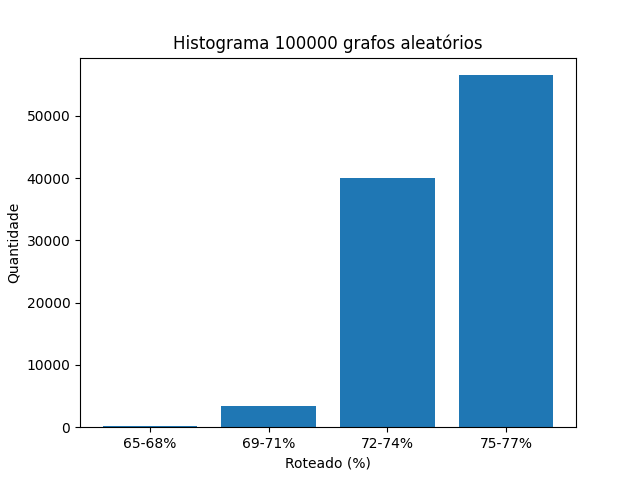

# Redes Multiestágio

## Como executar?

> ./route.sh <num_grafos_na_rede> <tipo_nomeamento> <num_iteracoes>

## observação

> Todos experimentos não consideraram que quando um vértice possui 2 entradas 
são dois sinal diferentes.\
Como a lista de arestas foi gerada: profundidade, na direção da saida para entrada.

## Resultados parciais 1:

* Algumas informações:

    > Rede: 256x256, radix4 e 4 estágios + 1 extra (5 estágios)\
    > Grafo:              Fir16\
    > Vértices:           49\
    > Aréstas:            63\
    > Grau médio:         2.57\
    > Cabem 63*4=252 "Arestas" (4 grafos Fir16)

* Roteamento:

    > Roteou 65.0794% - 1 grafo(s) - sequêncial.\
    > Roteou 76.1905% - 1 grafo(s) - aleatório.\
    > Roteou 16.2698% - 4 grafo(s) - sequêncial.\
    > Roteou 59.127%  - 4 grafo(s) - aleatório.

## Resultados parciais 2:

* Validação do roteamento:
    - Teste 1: [Roteamento padrão i -> i](./misc/results/route_pattern_test1.txt)
    - Teste 2: [Roteamento padrão i -> i+n](./misc/results/route_pattern_test2.txt)

* Histograma roteando 100.000x aleatório 1 grafo (Fir16):

    

* Roteando após eliminar arestas do grafo para aliviar a rede (acrescentar conexão local vértice acima):

    > Roteou 93.3333% - 1 grafo(s) - sequêncial.\
    > Roteou 23.3333% - 4 grafo(s) - sequêncial.\
    > Roteou 100%     - 1 grafo(s) - aleatório.\
    > Roteou 91.6667% - 4 grafo(s) - aleatório.
   
# Considerando entradas diferentes:
    1. estatística da distribuição dos graus de entrada Fir16 
    2. Propor uma distribuição T1 e T2 (ou T3)
    3. Fazer o sequencial e o randomico, pode explorar 2 opções de entrada e 2 de saida
    4. Testar para outros grafos 
