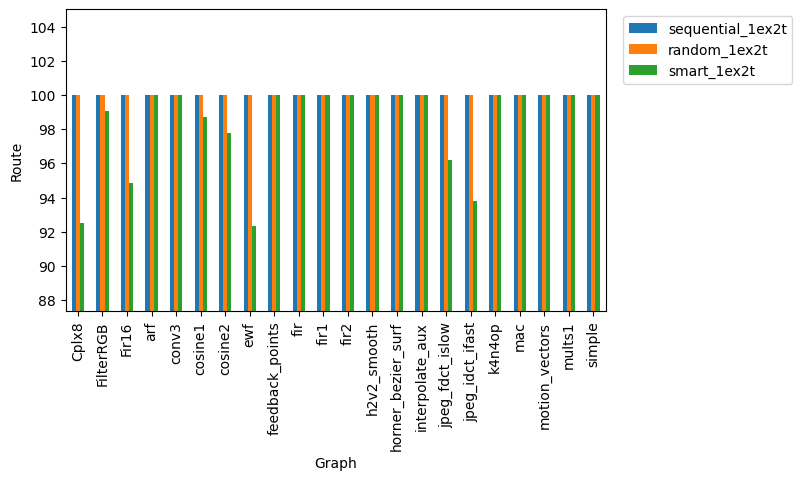

# Redes Multiestágio

## Como executar?

> ./route.sh <nome_do_grafo> ou ./route.sh all

## Informações da rede

> Rede Omega\
Entrada/Saída 256x256\
Radix4\
4 estágios\
'ex' estágios extras\
't' viagens

## Experimentos

### Rotulação

> Foram escolhidas 4 estratégias de rotulação dos grafos, sendo que a busca no grafo foi por largura da saida para entrada. São elas:

* Sequencial
* Aleatória
* Multicast com destino semelhante
* Sequencial com busca por rótulos vazios

[Exemplo de rotulação sequencial com busca por rótulos vazios](https://excalidraw.com/#json=mcoQI6aNquSjQq9sIgKTw,aCxus7q9PlLyHClMDEQ2kQ
)

### Roteamento

> Para o roteamento, usamos uma rede com 4 estágios, 1 estágio extra com 2 viagens e outra rede com 4 estágios, 4 estágios extras e 1 viagem.

> O algorítmo de roteamento pode ser visto na seção 4.2 em [REDE OMEGA VIRTUAL EM FPGA COM RECONFIGURAÇÃO EM TEMPO DE
EXECUÇÃO. ESTUDO DE CASO: CÁLCULO DE ATRATORES EM REDES
REGULADORAS DE GENES.](https://www.locus.ufv.br/bitstream/123456789/2634/1/texto%20completo.pdf)

### Benchmarks

> Na tabela abaixo, estão listados os benchmarks utilizados neste projeto e algumas métricas importantes.

|Grafo             |V/A    |grau máximo|grau médio|cabem na rede(máximo de arestas) |
|------------------|-------|-----------|----------|---------------------------------|
|k4n4op            |55/68  |4          |2.47      |3(204)                           |
|fir2              |40/39  |3          |1.95      |4(156)                           |
|interpolate_aux   |108/104|3          |1.93      |1(104)                           |
|Fir16             |49/63  |3          |2.57      |4(252)                           |
|horner_bezier_surf|17/16  |3          |1.88      |12(192)                          |
|h2v2_smooth       |52/55  |4          |2.12      |3(165)                           |
|jpeg_idct_ifast   |167/210|4          |2.51      |1(210)                           |
|mults1            |20/23  |4          |2.30      |9(207)                           |
|Cplx8             |46/60  |3          |2.61      |4(240)                           |
|cosine2           |81/91  |5          |2.25      |2(182)                           |
|ewf               |34/47  |5          |2.76      |5(235)                           |
|simple            |12/14  |6          |2.33      |14(196)                          |
|feedback_points   |54/51  |3          |1.89      |3(153)                           |
|motion_vectors    |32/29  |3          |1.81      |5(145)                           |
|arf               |28/30  |4          |2.14      |6(180)                           |
|conv3             |24/27  |7          |2.25      |7(189)                           |
|jpeg_fdct_islow   |173/210|4          |2.43      |1(210)                           |
|fir               |44/43  |3          |1.95      |3(129)                           |
|mac               |11/13  |5          |2.36      |16(208)                          |
|FilterRGB         |57/70  |4          |2.46      |3(210)                           |
|fir1              |44/43  |3          |1.95      |3(129)                           |
|cosine1           |66/76  |4          |2.30      |2(152)                           |

## Resultados

* Rede Com 4 estágios extras e 1 viagem

> Considere a tabela abaixo que apresenta o resultado dos roteamentos(%) obtidos com os algoritmos de rotulação **sequencial**, **sequencial com busca por rótulos vazios** e **aleatório**.

> Note que, nem todos os grafos aparecem na tabela abaixo. Esses foram resolvidos com a rotulação **sequencial**, isto é, atigiram o roteamento de 100%.

<h3 class="panel-title"></h3>

<table border=1 class="table table-striped table-bordered table-hover table-condensed" style="margin: 0 auto;">

<thead><tr><th title="Field #1">Grafo</th>
<th title="Field #2">Sequencial</th>
<th title="Field #3">SequencialComVazio</th>
<th title="Field #4">Aleatório(1000x)</th>
</tr></thead>
<tbody><tr><td>Cplx8</td>
<td align="center">99.1667</td>
<td align="center">100</td>
<td align="center">96.25</td>
</tr>
<tr><td>conv3</td>
<td align="center">99.4709</td>
<td align="center">99.4709</td>
<td align="center">100</td>
</tr>
<tr><td>feedback_points</td>
<td align="center">99.3464</td>
<td align="center">100</td>
<td align="center">100</td>
</tr>
<tr><td>fir2</td>
<td align="center">98.7179</td>
<td align="center">100</td>
<td align="center">100</td>
</tr>
<tr><td>h2v2_smooth</td>
<td align="center">99.3939</td>
<td align="center">100</td>
<td align="center">100</td>
</tr>
<tr><td>horner_bezier_surf</td>
<td align="center">96.8750</td>
<td align="center">100</td>
<td align="center">100</td>
</tr>
<tr><td>jpeg_fdct_islow</td>
<td align="center">99.0476</td>
<td align="center">100</td>
<td align="center">100</td>
</tr>
<tr><td>k4n4op</td>
<td align="center">99.5098</td>
<td align="center">100</td>
<td align="center">100</td>
</tr>
<tr><td>motion_vectors</td>
<td align="center">99.3103</td>
<td align="center">100</td>
<td align="center">100</td>
</tr>
<tr><td>mults1</td>
<td align="center">99.5169</td>
<td align="center">100</td>
<td align="center">100</td>
</tr>
</tbody></table>

  

* Rede Com 1 estágio extra e 2 viagem

> Com as segunda viagem, a rede ja é capaz de resolver com a estratégia sequencial.

## Conclusões

> Com os resultados obtidos, podemos concluir que, de fato, é possivel conectar várias cópias de um grafo, ao mesmo tempo e conseguir realizar o roteamento em uma rede bloqueante omega.

> Entretanto, mostramos apenas que é possivel na teoria. Na pratica, os recursos são limitados e usar 4 estágios extras ou realizar 2 viagens pode ser inviável. Assim, convém otimizar tanto as estratégias de rotulação, quanto as de roteamento, tendo em vista os padrões encontrados nestes experimentos.

> Nos proximos passos iremos tentar nos aproximar dos resultados obtidos aqui, mas com os parâmetros da rede próximos da realidade.

<!-- ## Como executar?

> ./route.sh <grafo\> 

> Para executar todos os grafos em 'misc\benchmark\dot':\
./route.sh all ou ./route.sh

## observação

> Todos experimentos não consideraram que quando um vértice possui 2 entradas 
são dois sinal diferentes.\
Como a lista de arestas foi gerada: profundidade, na direção da saida para entrada.

## Resultados parciais 1:

* Algumas informações:

    > Rede: 256x256, radix4 e 4 estágios + 1 extra (5 estágios)\
    > Grafo:              Fir16\
    > Vértices:           49\
    > Aréstas:            63\
    > Grau médio:         2.57\
    > Cabem 63*4=252 "Arestas" (4 grafos Fir16)

* Roteamento:

    > Roteou 65.0794% - 1 grafo(s) - sequencial - 1 estágios extras.\
    > Roteou 76.1905% - 1 grafo(s) - aleatório  - 1 estágios extras.\
    > Roteou 16.2698% - 4 grafo(s) - sequencial - 1 estágios extras.\
    > Roteou 59.127%  - 4 grafo(s) - aleatório  - 1 estágios extras.

## Resultados parciais 2:

* Validação do roteamento:
    - Teste 1: [Roteamento padrão i -> i](./misc/results/route_pattern_test1.txt)
    - Teste 2: [Roteamento padrão i -> i+n](./misc/results/route_pattern_test2.txt)

* Histograma roteando 1000x aleatório 1 grafo (Fir16):

    

* Roteando após eliminar arestas do grafo para aliviar a rede (acrescentar conexão local vértice acima):

    > Roteou 93.3333% - 1 grafo(s) - sequencial - 1 estágios extras.\
    > Roteou 23.3333% - 4 grafo(s) - sequencial - 1 estágios extras.\
    > Roteou 100%     - 1 grafo(s) - aleatório  - 1 estágios extras.\
    > Roteou 91.6667% - 4 grafo(s) - aleatório  - 1 estágios extras.
   
# Considerando entradas diferentes:

## Resultados parciais 3:

### 1. Estatística da distribuição dos graus dos entrada

Grafo|grau 0|grau 1|grau 2|grau 3|Rótulos
---|---|---|---|---|---|
Fir16|1|33|15|0|63
**k4n4op**|4|35|15|1|68
fir2|16|9|15|0|39
interpolate_aux|48|16|44|0|104
horner_bezier_surf|4|10|3|0|16
h2v2_smooth|16|17|19|0|55
**jpeg_idct_ifast**|24|76|67|0|210
mults1|1|15|4|0|23
Cplx8|1|30|15|0|60
cosine2|31|9|41|0|91
ewf|2|17|15|0|47
simple|4|2|6|0|14
feedback_points|21|15|18|0|51
motion_vectors|14|7|11|0|29
arf|8|10|10|0|30
conv3|9|3|12|0|27
**jpeg_fdct_islow**|24|88|61|0|210
fir|22|1|21|0|43
mac|3|3|5|0|13
FilterRGB|2|40|15|0|70
fir1|22|1|21|0|43
cosine1|16|24|26|0|76

***
### 2. Propor uma distribuição T1 e T2 (ou T3)

> De fato, temos 1\*0 + 33\*1 + 15\*2 = 63 rótulos possíveis. Sequencialmente, poderíamos rotular de *0000 0000* até *0011 1111*. Assim, para os 33 rótulos podemos usar de índice os 2 últimos bits mais significativos sendo o 00. Já para os outros 30 rótulos podemos usar 01, 10 ou 11 como índices. Assim, usemos:

* Rótulos de vértices com grau 1:
    
    > *00xx xxxx*

* Rótulos de vértices com grau 2:

    > *01xx xxxx*\
        ou  
    *10xx xxxx*

* observação:

    > Nesse caso não da pra colocar mais de um grafo na rede, porque o primeiro grafo já ocupa 33 dos 63 rótulos de grau 1. Logo, o segundo teria apenas 30 rótulos, mas são necessários 33.
***
### 3. Fazer o sequencial e o aleatório

* Roteamento considerando entradas diferentes:

    > Roteou 96.8254% - 1 grafo(s) - T2 sequencial - 1 estágios extras.\
    > Roteou 100%     - 1 grafo(s) - T2 aleatório  - 1 estágios extras.

* Histograma roteando 1000x aleatório 1 grafo (Fir16):

    

***
### 4. Testar para outros grafos 

* Roteamento: 

    Grafo|Roteado(%)|Grafos na Rede|Rotulamento|Estágio Extra
    ---|---|---|---|---|
    arf  |63.3333|1|sequencial|1
    arf  |66.6667|1|aleatório|1
    arf  |100|1|T2 sequencial|1
    arf  |100|1|T2 aleatório|1
    conv3  |55.5556|1|sequencial|1
    conv3  |55.5556|1|aleatório|1
    conv3  |92.5926|1|T2 sequencial|1
    conv3  |100|1|T2 aleatório|1
    cosine1  |57.8947|1|sequencial|1
    cosine1  |64.4737|1|aleatório|1
    cosine1  |97.3684|1|T2 sequencial|1
    cosine1  |98.6842|1|T2 aleatório|1
    cosine2  |52.7473|1|sequencial|1
    cosine2  |53.8462|1|aleatório|1
    cosine2  |87.9121|1|T2 sequencial|1
    cosine2  |87.9121|1|T2 aleatório|1
    Cplx8  |66.6667|1|sequencial|1
    Cplx8  |75|1|aleatório|1
    Cplx8  |96.6667|1|T2 sequencial|1
    Cplx8  |95|1|T2 aleatório|1
    ewf  |53.1915|1|sequencial|1
    ewf  |68.0851|1|aleatório|1
    ewf  |100|1|T2 sequencial|1
    ewf  |97.8723|1|T2 aleatório|1
    feedback_points  |62.7451|1|sequencial|1
    feedback_points  |64.7059|1|aleatório|1
    feedback_points  |100|1|T2 sequencial|1
    feedback_points  |96.0784|1|T2 aleatório|1
    FilterRGB  |61.4286|1|sequencial|1
    FilterRGB  |78.5714|1|aleatório|1
    FilterRGB  |95.7143|1|T2 sequencial|1
    FilterRGB  |94.2857|1|T2 aleatório|1
    Fir16  |65.0794|1|sequencial|1
    Fir16  |76.1905|1|aleatório|1
    Fir16  |96.8254|1|T2 sequencial|1
    Fir16  |96.8254|1|T2 aleatório|1
    fir1  |51.1628|1|sequencial|1
    fir1  |51.1628|1|aleatório|1
    fir1  |97.6744|1|T2 sequencial|1
    fir1  |100|1|T2 aleatório|1
    fir2  |58.9744|1|sequencial|1
    fir2  |61.5385|1|aleatório|1
    fir2  |100|1|T2 sequencial|1
    fir2  |100|1|T2 aleatório|1
    fir  |48.8372|1|sequencial|1
    fir  |51.1628|1|aleatório|1
    fir  |86.0465|1|T2 sequencial|1
    fir  |97.6744|1|T2 aleatório|1
    h2v2_smooth  |61.8182|1|sequencial|1
    h2v2_smooth  |65.4545|1|aleatório|1
    h2v2_smooth  |100|1|T2 sequencial|1
    h2v2_smooth  |100|1|T2 aleatório|1
    horner_bezier_surf  |81.25|1|sequencial|1
    horner_bezier_surf  |81.25|1|aleatório|1
    horner_bezier_surf  |100|1|T2 sequencial|1
    horner_bezier_surf  |100|1|T2 aleatório|1
    interpolate_aux  |56.7308|1|sequencial|1
    interpolate_aux  |57.6923|1|aleatório|1
    interpolate_aux  |85.5769|1|T2 sequencial|1
    interpolate_aux  |88.4615|1|T2 aleatório|1
    jpeg_fdct_islow  |-|1|sequencial|1
    jpeg_fdct_islow  |-|1|aleatório|1
    jpeg_fdct_islow  |-|1|T2 sequencial|1
    jpeg_fdct_islow  |-|1|T2 aleatório|1
    jpeg_idct_ifast  |-|1|sequencial|1
    jpeg_idct_ifast  |-|1|aleatório|1
    jpeg_idct_ifast  |-|1|T2 sequencial|1
    jpeg_idct_ifast  |-|1|T2 aleatório|1
    k4n4op  |-|1|sequencial|1
    k4n4op  |-|1|aleatório|1
    k4n4op  |-|1|T2 sequencial|1
    k4n4op  |-|1|T2 aleatório|1
    mac  |61.5385|1|sequencial|1
    mac  |61.5385|1|aleatório|1
    mac  |100|1|T2 sequencial|1
    mac  |100|1|T2 aleatório|1
    motion_vectors  |62.069|1|sequencial|1
    motion_vectors  |62.069|1|aleatório|1
    motion_vectors  |100|1|T2 sequencial|1
    motion_vectors  |100|1|T2 aleatório|1
    mults1  |73.913|1|sequencial|1
    mults1  |82.6087|1|aleatório|1
    mults1  |91.3043|1|T2 sequencial|1
    mults1  |100|1|T2 aleatório|1
    removed_Fir16  |96.6667|1|sequencial|1
    removed_Fir16  |100|1|aleatório|1
    removed_Fir16  |86.6667|1|T2 sequencial|1
    removed_Fir16  |100|1|T2 aleatório|1
    simple  |57.1429|1|sequencial|1
    simple  |57.1429|1|aleatório|1
    simple  |100|1|T2 sequencial|1
    simple  |100|1|T2 aleatório|1

***

## Resultados parciais 4:

### Roteando com duas passadas:

Grafo|Rotulamento|Roteado(%)|N° arestas primeira passada|N° arestas segunda passada|Total
---|---|---|---|---|---|
Fir16|sequencial T2|100|61|2|63
Fir16|aleatório T2|100|61|2|63
interpolate_aux|sequencial T2|99.0385|89|15|104
interpolate_aux|aleatório T2|100|94|10|104
feedback_points|sequencial T2|100|51|0|51
feedback_points|aleatório T2|100|51|0|51

***

    

https://excalidraw.com/#json=GTrRFjLosl7m_28-Dths1,Pa5u9hOli3ouL2DkZGeTCw

<table>
<tr><th></th><th></th></tr>
<tr><td>

Grafo| Roteamento | Rótulos utilizados (% deixei de usar) |Máximo de rótulos
---|---|---|---|
arf|100.0|210 (12.5%) |240
conv3|100.0|189 (22.2%)|243
feedback_points|100.0|153 (40.0%)|255
fir|100.0|172 (20.0%)|215
fir1|100.0|172 (20.0%)|215
fir2|100.0|195 (16.6%)|234
horner_bezier_surf|100.0|224 (12.5%)|256
interpolate_aux|100.0|104 (50.0%)|208
motion_vectors|100.0|174 (25.0%)|232
mac|100.0|208 (15.7%)|247
simple|100.0|210 (16.6%)|252

</td><td>

Grafo| Roteamento | Rótulos utilizados (% deixei de usar) |Máximo de rótulos
---|---|---|---|
Fir16|100.0|252 (0.0%)|252
k4n4op|100.0|204 (0.0%)|204
h2v2_smooth|100.0|220 (0.0%)|220
jpeg_idct_ifast|100.0|210 (0.0%)|210
mults1|100.0|253 (0.0%)|253
Cplx8|100.0|240 (0.0%)|240
cosine2|100.0|182 (0.0%)|182
ewf|100.0|235 (0.0%)|235
jpeg_fdct_islow|100.0|210 (0.0%)|210
FilterRGB|100.0|210 (0.0%)|210
cosine1|100.0|228 (0.0%)|228

</td></tr> </table>

<table>
<tr><th></th><th></th></tr>
<tr><td>

Grafo| Roteamento | Rótulos utilizados (% deixei de usar) |Máximo de rótulos
---|---|---|---|
arf|100.0|60 (75.0%) |240
conv3|100.0| 108 (55.5%)|243
feedback_points|100.0| 102 (60.0%)|255
fir|100.0| 172 (20.0%)|215
fir1|100.0|129 (40.0%)|215
fir2|100.0|156 (33.3%)|234
horner_bezier_surf|100.0| 192 (25.0%)|256
interpolate_aux|100.0|104 (50.0%)|208
motion_vectors|100.0|174 (25.0%)|232
mac|100.0| 156 (36.8%)|247
simple|100.0| 154 (38.8%)|252

</td><td>

Grafo| Roteamento | Rótulos utilizados (% deixei de usar) |Máximo de rótulos
---|---|---|---|
Fir16|100.0| 63 (75.0%)|252
k4n4op| 98.5294 | 68 (66.6%)|204
h2v2_smooth| 98.1818 | 55 (75.0%)|220
jpeg_idct_ifast| 75.2381 |210 (0.0%)|210
mults1|100.0| 115 (54.5%)|253
Cplx8| 86.6667 | 60 (75.0%)|240
cosine2| 89.011 | 91 (50.0%)|182
ewf|87.234| 47 (80.0%)|235
jpeg_fdct_islow| 78.5714 |210 (0.0%)|210
FilterRGB|100.0| 70 (66.6%)|210
cosine1| 84.2105  | 76 (66.6%)|228

</td></tr> </table>

<table>
<tr><th></th><th></th></tr>
<tr><td>

Grafo|	Roteamento | Rótulos utilizados (% deixei de usar) | Máximo de rótulos
---|---|---|---|
arf|	100.0 | 180 (25.0%)| 240
conv3|	100.0 | 189 (22.2%)| 243
feedback_points| 100.0 | 153 (40.0%)| 255
fir|	100.0 | 172 (20.0%)| 215
fir1|	100.0 | 172 (20.0%)| 215
fir2|	100.0 | 156 (33.3%)| 234
horner_bezier_surf|	100.0 | 192 (25.0%)| 256
interpolate_aux|	100.0 | 104 (50.0%)| 208
motion_vectors|	100.0 | 174 (25.0%)| 232
mac|	100.0 | 208 (15.7%)| 247
simple|	100.0 | 196 (22.2%)| 252

</td><td>

Grafo|	Roteamento | Rótulos utilizados (% deixei de usar) | Máximo de rótulos
---|---|---|---|
Fir16|	100.0 | 189 (25.0%)| 252
k4n4op|	100.0 | 204 (0.0%)| 204
h2v2_smooth|	100.0 | 165 (25.0%)| 220 
jpeg_idct_ifast|	100.0 | 210 (0.0%)| 210
mults1|	100.0 | 207 (18.1%)| 253
Cplx8|	100.0 | 180 (25.0%)| 240
cosine2|	100.0 | 182 (0.0%)| 182
ewf|	100.0 | 188 (20.0%)| 2354
jpeg_fdct_islow|	100.0 | 210 (0.0%)| 210
FilterRGB|	100.0 | 210 (0.0%) | 210
cosine1|	1400.0 | 152 (33.3%)| 228

</td></tr> </table> -->
